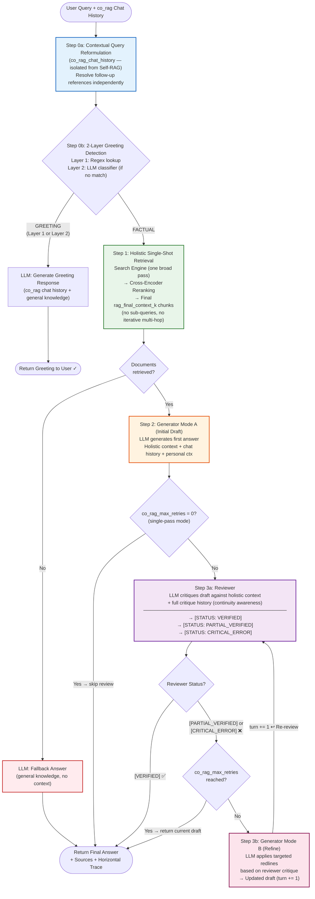

# Co-RAG Pipeline Diagram ⭐

---

## Description

- Entry: user's raw query + `co_rag_content` chat history (completely independent from Self-RAG history).

**Step 0a – Contextual Query Reformulation:**

- Reformulate the query using `co_rag_chat_history` (isolated from `self_rag_chat_history`) to resolve follow-up references.
- See the Contextual Query Reformulation diagram for full details.

**Step 0b – 2-Layer Greeting Detection:**

- Run greeting detection on the Co-RAG reformulated query (see Greeting Detection diagram).
- If greeting detected in Layer 1 or Layer 2 → call the LLM to generate a greeting response using its general knowledge and the co_rag chat history → return to the user, end the Co-RAG pipeline.
- If FACTUAL → proceed to Step 1.

**Step 1 – Holistic Single-Shot Retrieval:**

- Run the search engine with one broad retrieval pass (no sub-query decomposition, unlike Self-RAG).
- Run Cross-Encoder Reranking on the retrieved documents and select the top `rag_final_context_k` chunks (see Search and Reranking diagrams).
- If no documents are retrieved → the LLM generates a fallback answer from its general knowledge (no context) → return to the user, end the pipeline.

**Step 2 – Generator Mode A (Initial Draft):**

- The LLM generates an initial draft answer based on the holistic context, the reformulated query, and the chat history.
- If `co_rag_max_retries` = 0 → skip the review loop entirely → return this draft immediately as the final answer. End the pipeline.

**Step 3 – Generator ↔ Reviewer Loop (up to `co_rag_max_retries` turns):**

- *Step 3a – Reviewer:*
  - The Reviewer LLM critiques the current draft against the holistic context and the full critique history from all previous turns (to maintain continuity).
  - Output: one of three statuses:
    - [VERIFIED] → the draft is correct and well-grounded → return the current draft as the final answer. End the pipeline.
    - [PARTIAL_VERIFIED] → the draft is partially correct but has addressable issues.
    - [CRITICAL_ERROR] → the draft has major errors that must be fixed.
  - If the reviewer returns [PARTIAL_VERIFIED] or [CRITICAL_ERROR] and `co_rag_max_retries` is already reached → return the current draft as the final answer anyway. End the pipeline.

- *Step 3b – Generator Mode B (Refinement):*
  - The Generator LLM applies targeted fixes to the draft based on the reviewer's specific critique.
  - Output: a refined, improved draft.
  - Increment the turn counter by 1 and loop back to Step 3a for re-review.

- Return the final answer with sources and horizontal trace.
