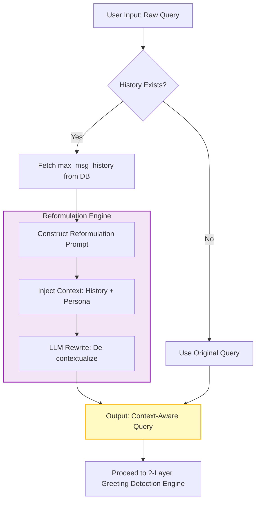

# Contextual Reformulation Diagram 💬

---

## Description

- Take the user's raw query along with the latest `max_msg_history` messages from the chat history (both user and assistant turns).
- If no chat history exists → use the original query as-is and skip the reformulation step entirely.
- If chat history exists → pass the original query and the history to the LLM reformulation engine.
  - The LLM rewrites the query to be fully standalone and context-aware (e.g., resolves pronoun references such as "tell me more about it" into explicit standalone questions).
  - Output: a context-aware standalone reformulated query.
- Proceed with the reformulated query (or the original if no history) to the 2-Layer Greeting Detection.
