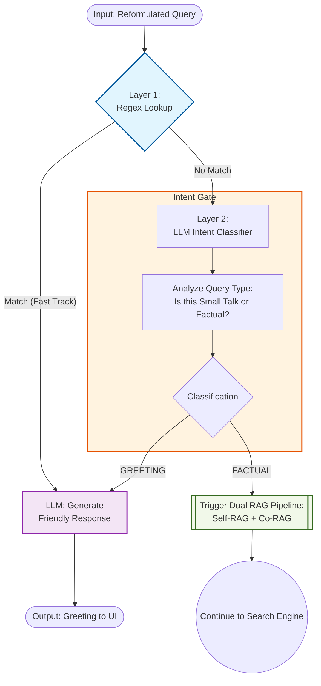

# 2-Layer Greeting Detection Diagram 👋

---

## Description

- Input: reformulated query (from contextual query reformulation).

**Layer 1 – Regex Lookup:**

- Lookup the reformulated query against a robust, multi-language greeting regex pattern list.
- If the query matches any pattern → greeting detected at Layer 1 → call the LLM to generate a friendly greeting response using its general knowledge and the chat history → return the response to the user and end the pipeline.
- If no pattern matches → no greeting detected at Layer 1 → proceed to Layer 2.

**Layer 2 – LLM Intent Classifier:**

- Call the LLM to classify the reformulated query as either a GREETING (small talk) or a FACTUAL question.
- If the LLM classifies as GREETING → call the LLM to generate a friendly greeting response using its general knowledge and the chat history → return the response to the user and end the pipeline.
- If the LLM classifies as FACTUAL → the query is a real question → continue to the Dual RAG Pipeline (Self-RAG + Co-RAG).
