# Ingestion Pipeline Diagram 📥

```mermaid
flowchart TD
    Start(["User Uploads File(s)\n(PDF or DOCX)"]) --> FileLoop

    FileLoop["For Each Uploaded File"]

    FileLoop --> MagicBytes["Detect File Type\nby Magic Bytes\n(PDF: starts with '%PDF'\nDOCX: starts with 'PK\\x03\\x04')"]

    MagicBytes --> TypeCheck{"Supported\nFile Type?"}
    TypeCheck -- "No" --> Reject[/"Reject File\n❌ Unsupported format"/]
    TypeCheck -- "Yes (PDF / DOCX)" --> HashCheck

    HashCheck["Compute MD5 Hash\nof File Content\n(for duplicate detection)"]

    HashCheck --> DupCheck{"Already uploaded\nto this notebook?"}
    DupCheck -- "Yes → skip" --> DupReject[/"Skip Upload\n⚠️ Duplicate detected\n(same hash in notebook)"/]
    DupCheck -- "No" --> Convert

    Convert{"File Type?"}

    Convert -- "PDF" --> PDFConvert["PDF → Markdown\n(_pdf_to_markdown)\n───────────────────────────\nFor each page:\n  • page.get_text('dict', sort=True)\n  • Collect all font sizes → compute page median\n  • Per block: infer heading level by font-size ratio\n      ≥ 1.5× median → # H1\n      ≥ 1.25× median → ## H2\n      ≥ 1.1× median → ### H3\n  • Span flags: bold (**), italic (*), both (***)\n  • Skip image/drawing blocks (type ≠ 0)\n  • Output: List[(page_num, markdown_str)]"]

    Convert -- "DOCX" --> DOCXConvert["DOCX → Markdown\n(_docx_to_markdown)\n───────────────────────────\nWalk body elements in document order:\n  • qn('w:p') → Paragraph\n      - Heading 1–4 → # / ## / ### / ####\n      - List paragraphs → - bullet or 1. numbered\n      - Normal text → plain paragraph\n  • qn('w:tbl') → Table\n      - Render as Markdown pipe table  |col|col|\n  • Output: single whole-document markdown_str"]

    PDFConvert --> Clean
    DOCXConvert --> Clean

    Clean["Clean Markdown Text\n(_clean_markdown_text)\n──────────────────────────────\n• Remove stray page-number lines\n  (lines containing only a digit)\n• Collapse 3+ consecutive blank\n  lines → 2 blank lines\n• Strip leading/trailing whitespace"]

    Clean --> Split

    Split["Stage 2: Markdown-Aware Chunking\n────────────────────────────────────────────\nPrimary: MarkdownHeaderTextSplitter\n  headers: #(h1) ##(h2) ###(h3) ####(h4)\n  strip_headers=False (keep headers in chunk text)\n\nFor each header-bounded section:\n  • If section length ≤ chunk_size → keep as-is\n  • If section length > chunk_size →\n      Fallback: RecursiveCharacterTextSplitter\n        separators: [\\n\\n, \\n, space, '']\n        chunk_size = rag_max_chunk_len\n        chunk_overlap = rag_chunk_overlap\n\nMetadata per chunk:\n  source = file_path\n  page   = page_num (PDF) | 'N/A' (DOCX)\n  h1/h2/h3/h4 = inherited header context"]

    Split --> Enrich["Enrich Chunk Metadata\n(chunk_and_process_file)\n──────────────────────\nchunk.metadata['document'] = filename\n(original display name for UI citation)"]

    Enrich --> Embed["Generate Embeddings\n(try_load_embeddings)\n──────────────────────────────\nModel: paraphrase-multilingual-mpnet-base-v2\n  (HuggingFaceEmbeddings, 768-dim)\nLoad order: GPU first → CPU fallback\nInput: chunk.page_content (Markdown string)\nOutput: 768-dim float vector per chunk"]

    Embed --> FAISS["Build FAISS Index\n(create_vectorstore_from_chunks)\n────────────────────────────────\nIndex type: IndexFlatL2 (CPU)\nDistance: Euclidean (L2)\nStores: vectors + original chunk documents"]

    FAISS --> SaveVS["Save Vectorstore to Disk\n────────────────────────────────────────────\nPath: ./data/vectorstores/{notebook_id}/{source_id}/\n  • index.faiss  — FAISS binary index\n  • index.pkl    — serialized chunk documents\nEach source gets its own isolated directory\n(enables selective retrieval & clean deletion)"]

    SaveVS --> Merge{"Existing session\nvectorstore?"}
    Merge -- "No (first upload)" --> UseNew["Use New Vectorstore\nas session vectorstore"]
    Merge -- "Yes" --> MergeVS["Merge with Session Vectorstore\n(FAISS.merge_from)\nCombines all uploaded sources\ninto one in-memory index"]

    UseNew --> SaveDB
    MergeVS --> SaveDB

    SaveDB["Persist Metadata to SQLite\n(./data/smartdoc.db)\n────────────────────────────────\nTable: sources\n  • source_id   (UUID)\n  • notebook_id (FK)\n  • filename\n  • file_hash   (MD5, dedup key)\n  • vectorstore_path\n  • summary\n  • suggested_questions"]

    SaveDB --> RebuildChain["Rebuild Self-RAG Chain\n(reload_vectorstore_and_chain)\nwith updated merged vectorstore"]

    RebuildChain --> Done(["✅ Upload Complete\nSource available for querying"])

    %% Styling
    classDef conversion fill:#e3f2fd,stroke:#1565c0,stroke-width:2px
    classDef split fill:#e8f5e9,stroke:#2e7d32,stroke-width:2px
    classDef storage fill:#fff3e0,stroke:#e65100,stroke-width:2px
    classDef reject fill:#ffebee,stroke:#c62828,stroke-width:2px
    classDef embed fill:#f3e5f5,stroke:#6a1b9a,stroke-width:2px

    class PDFConvert,DOCXConvert,Clean conversion
    class Split,Enrich split
    class FAISS,SaveVS,Merge,MergeVS,UseNew,SaveDB storage
    class Reject,DupReject reject
    class Embed embed
```

---

## Description

**Entry:** user uploads one or more files (PDF or DOCX) through the Streamlit UI.

**File type detection:**

- File type is determined by reading the raw magic bytes (file signature), not the file extension.
- `%PDF` header → PDF; `PK\x03\x04` / `PK\x05\x06` / `PK\x07\x08` header → DOCX (ZIP-based Office format).
- Any other format is rejected immediately with an error message.

**Duplicate detection:**

- MD5 hash of the raw file bytes is computed before any processing.
- If a source with the same hash already exists in the same notebook, the upload is skipped silently — no re-embedding, no duplicate index entry.

**Stage 1 — Markdown conversion:**

*PDF (`_pdf_to_markdown`):*

- Uses `page.get_text("dict", sort=True)` (native PyMuPDF, no extra packages required) to get structured text with per-span font metadata.
- Per page: all span font sizes are collected, the median is computed as the body-text baseline.
- Each text block's dominant font size is compared against the median to assign heading level (`#`, `##`, `###`). Body text is left as-is.
- Span flags decode bold (bit 4) and italic (bit 1) to `**bold**` / `*italic*` / `***both***`.
- Image and drawing blocks (type ≠ 0) are skipped.
- Returns a list of `(page_number, markdown_string)` tuples — one entry per page.

*DOCX (`_docx_to_markdown`):*

- Walks the document body in element order using `qn("w:p")` / `qn("w:tbl")` tag matching (avoids private `_element` attribute).
- Paragraph styles map to `#`, `##`, `###`, `####` for heading levels; list paragraphs map to `-` (unordered) or `1.` (ordered); tables render as Markdown pipe tables `| col | col |`.
- Returns a single Markdown string covering the whole document (no page boundaries in DOCX).

*Cleaning (`_clean_markdown_text`):*

- Removes lines containing only a digit (common PDF page-number artifacts).
- Collapses three or more consecutive blank lines to two.
- Strips leading and trailing whitespace.

**Stage 2 — Markdown-aware chunking:**

- Primary splitter: `MarkdownHeaderTextSplitter` on `#`, `##`, `###`, `####`. `strip_headers=False` so heading text is included inside each chunk for LLM context.
- Fallback splitter: any section exceeding `rag_max_chunk_len` characters is further split by `RecursiveCharacterTextSplitter` with separators `["\n\n", "\n", " ", ""]`, preserving logical paragraph breaks before resorting to mid-text breaks.
- Each chunk inherits parent `source` and `page` metadata; header context keys (`h1`–`h4`) are set by the splitter.
- After splitting, `chunk.metadata["document"]` is set to the original display filename for UI source citations.

**Embedding:**

- Model: `paraphrase-multilingual-mpnet-base-v2` (HuggingFace Sentence Transformers, 768-dimensional output).
- GPU is attempted first; falls back to CPU automatically if GPU is unavailable or OOMs.
- Each chunk's `page_content` (a Markdown string) is embedded as-is — the model handles Markdown syntax tokens transparently.

**FAISS index creation and storage:**

- An `IndexFlatL2` (CPU) index is built from all chunk vectors.
- The index is saved immediately to `./data/vectorstores/{notebook_id}/{source_id}/` as `index.faiss` + `index.pkl` before any merge — this preserves the per-source index for selective retrieval and clean deletion.
- The new index is then merged into the in-memory session vectorstore (`FAISS.merge_from`) so all uploaded sources are queryable together within the session.

**SQLite persistence:**

- A record is inserted into the `sources` table with the `source_id`, `notebook_id`, `filename`, MD5 hash, vectorstore path, generated summary, and suggested questions.
- The `file_hash` + `notebook_id` pair is the unique constraint used for duplicate detection.

**Chain rebuild:**

- After each upload, the Self-RAG chain is rebuilt with the updated merged vectorstore so new sources are immediately available for querying.
