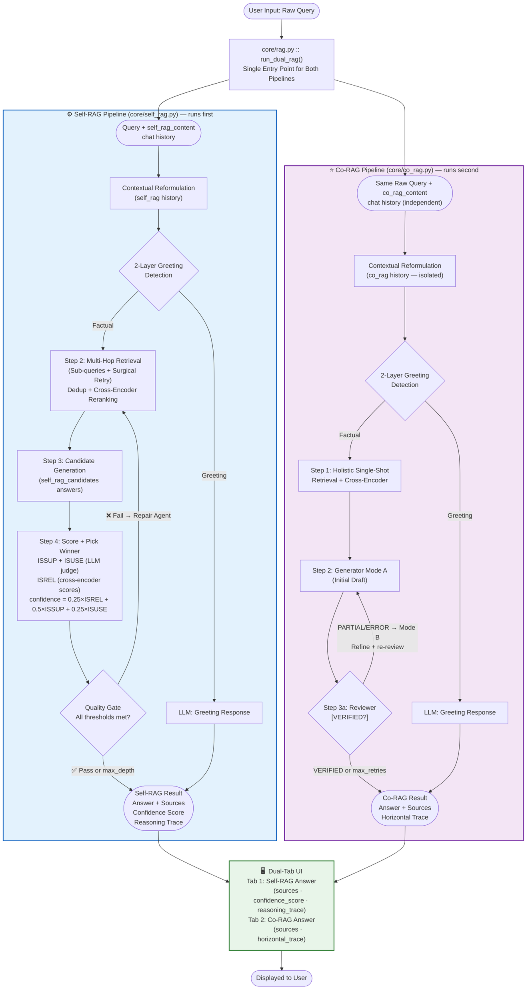

# Dual-Pipeline RAG System Diagram 🔀

---

## Description

- Entry: the user's raw query enters `core/rag.py :: run_dual_rag()` — the single entry point that orchestrates both pipelines sequentially.
- Both pipelines receive the same raw query but maintain completely independent state: Self-RAG uses `self_rag_content` chat history, and Co-RAG uses `co_rag_content` chat history. They never share history.

**Self-RAG pipeline runs FIRST** (see Self-RAG diagram for full details):

- The query + `self_rag_content` history go through independent contextual query reformulation.
- Then 2-Layer Greeting Detection using the Self-RAG reformulated query.
- If greeting detected → the LLM generates a greeting response (stored as the Self-RAG result).
- If FACTUAL → run the full Self-RAG pipeline (Steps 1–5b) and return the answer with confidence score and reasoning trace.

**Co-RAG pipeline runs SECOND** (see Co-RAG diagram for full details):

- The same raw query + `co_rag_content` history go through independent contextual query reformulation (completely isolated from Self-RAG's history and reformulated query).
- Then 2-Layer Greeting Detection using the Co-RAG reformulated query.
- If greeting detected → the LLM generates a greeting response (stored as the Co-RAG result).
- If FACTUAL → run the full Co-RAG pipeline (Steps 0a–3b) and return the answer with sources and horizontal trace.

**Display:**

- Both pipeline results are collected and displayed side by side in the Dual-Tab UI:
  - Tab 1: Self-RAG answer, showing its sources, confidence score, and reasoning trace.
  - Tab 2: Co-RAG answer, showing its sources and horizontal trace.
- Each pipeline is fully independent — a greeting detected in one pipeline does not affect or short-circuit the other.
