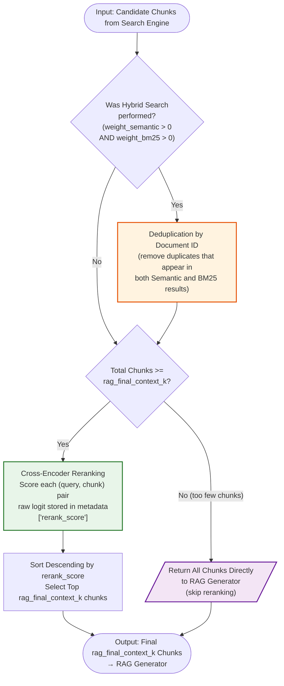

# Cross-Encoder Reranking Diagram ⚖️

---

## Description

- Input: candidate chunks from the search engine.
- If the hybrid search was performed (both `weight_semantic` > 0 and `weight_bm25` > 0) → deduplicate the candidate pool by document ID, because the semantic and BM25 retrievers can return overlapping documents.
- If the total deduplicated chunk count < `rag_final_context_k` → skip Cross-Encoder reranking entirely → return all chunks directly to the RAG generator.
- If the total chunk count >= `rag_final_context_k` → run Cross-Encoder reranking:
  - Score each (query, chunk) pair with the Cross-Encoder model.
  - Store the raw logit score in the document's metadata under `rerank_score`.
  - Sort all chunks descending by `rerank_score`.
  - Select the top `rag_final_context_k` chunks.
- Return the final chunks to the RAG generator.
