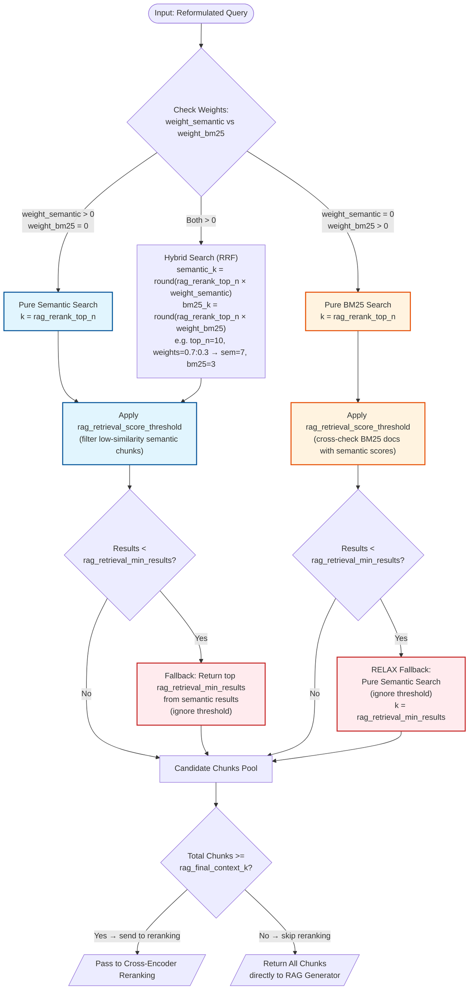

# Search Engine Diagram 🔍

---

## Description

- Input: reformulated query.
- Look at the `weight_semantic` and `weight_bm25` parameters to determine which type of search to perform:
  - If `weight_semantic` > 0 and `weight_bm25` = 0 → perform **pure semantic search**, fetching up to `rag_rerank_top_n` documents.
  - If `weight_semantic` = 0 and `weight_bm25` > 0 → perform **pure BM25 keyword search**, fetching up to `rag_rerank_top_n` documents.
  - If both `weight_semantic` > 0 and `weight_bm25` > 0 → perform **hybrid search** (Reciprocal Rank Fusion of semantic + BM25):
    - Semantic retriever fetches: `round(rag_rerank_top_n × weight_semantic)` documents (e.g. top_n=10, weight=0.7 → 7 docs).
    - BM25 retriever fetches: `round(rag_rerank_top_n × weight_bm25)` documents (e.g. top_n=10, weight=0.3 → 3 docs).
    - Results from both are fused and re-ranked by RRF scoring.

**After pure semantic search or hybrid search:**

- Filter the retrieved documents from the semantic component by `rag_retrieval_score_threshold` (L2 distance; lower = better).
- If the filtered results count < `rag_retrieval_min_results` → fallback: return the top `rag_retrieval_min_results` unfiltered documents from semantic search (ignore threshold).

**After pure BM25 search:**

- Cross-check BM25 results against semantic similarity scores so that `rag_retrieval_score_threshold` can meaningfully filter them (without this, all BM25 docs get score 0.0 and always pass).
- Apply the score threshold filter.
- If the filtered results count < `rag_retrieval_min_results` → RELAX fallback: execute pure semantic search (ignoring the threshold) to fetch the top `rag_retrieval_min_results` documents.
- If the initial BM25 search returns 0 documents → RELAX fallback is triggered immediately.

**After gathering results from any search mode:**

- Pool all candidate chunks.
- If total chunks >= `rag_final_context_k` → pass to Cross-Encoder Reranking for refinement (see Reranking diagram).
- If total chunks < `rag_final_context_k` → return all chunks directly to the RAG generator, skip reranking.
