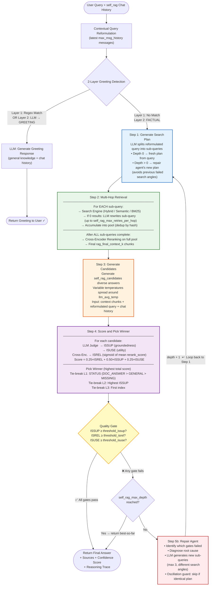

# Self-RAG Pipeline Diagram ⚙️

---

## Description

- Entry: reformulated query + `self_rag_content` chat history.
- Run 2-Layer Greeting Detection (see Greeting Detection diagram):
  - If greeting detected in Layer 1 or Layer 2 → call the LLM to generate a greeting response using its general knowledge and the chat history → return to the user, end the Self-RAG pipeline.
  - If FACTUAL → proceed to the main Self-RAG loop.

The following steps run in a loop (up to `self_rag_max_depth + 1` iterations total):

**Step 1 – Search Plan Generation:**

- At depth 0: the LLM decomposes the reformulated query into multiple targeted sub-queries (each focused on a different search angle).
- At depth > 0 (after a repair): the repair agent's newly generated sub-queries replace the previous failed plan, targeting different search angles to avoid repeating the same failures.

**Step 2 – Multi-Hop Retrieval (per sub-query):**

- For each sub-query in the search plan:
  - Run the search engine (Hybrid / Semantic / BM25) to retrieve documents.
  - If the search returns 0 results → rewrite the sub-query using the LLM and retry, up to `self_rag_max_retries_per_hop` attempts.
  - If results are found (or retries exhausted) → add the documents to the shared pool.
  - Deduplication is applied incrementally as each sub-query's results are merged (by content hash).
- After ALL sub-queries have been processed:
  - Run Cross-Encoder Reranking on the full deduplicated pool.
  - Select the top `rag_final_context_k` chunks as the final retrieved context.

**Step 3 – Candidate Answer Generation:**

- Call the LLM `self_rag_candidates` times to generate diverse answer candidates.
- Each call uses a slightly different temperature (spread around `llm_avg_temp`) to encourage diversity.
- Input for each call: final retrieved context + reformulated query + chat history.

**Step 4 – Scoring and Winner Selection:**

- For each candidate answer:
  - LLM judge evaluates: ISSUP (groundedness — is the answer supported by the context?) and ISUSE (utility — is the answer useful and relevant to the question?).
  - Cross-Encoder scores from Step 2 are used to compute ISREL = mean(sigmoid(rerank_scores)) across all context documents.
  - Final confidence score = 0.25 × ISREL + 0.50 × ISSUP + 0.25 × ISUSE.
- Pick the winner (highest confidence score), using tie-breaking in order:
  - Layer 1: Prefer STATUS = DOC_ANSWER over DOC_GENERAL over DOC_MISSING.
  - Layer 2: Prefer the candidate with the higher ISSUP score.
  - Layer 3: Prefer the candidate with the lower index (first generated wins).

**Step 5a – Quality Gate:**

- Check if the winner meets all thresholds: ISSUP >= `self_rag_threshold_issup`, ISREL >= `self_rag_threshold_isrel`, ISUSE >= `self_rag_threshold_isuse`.
- If all gates pass → return the winner answer to the user with sources, confidence score, and reasoning trace. End the pipeline.
- If any gate fails:
  - If `self_rag_max_depth` is reached → return the best-so-far winner anyway. End the pipeline.
  - If `self_rag_max_depth` is not reached → proceed to Step 5b (Repair Agent).

**Step 5b – Repair Agent:**

- Diagnose which quality gates failed and why (e.g. low groundedness, low relevance).
- Generate a new search plan with different sub-queries (max 3) that target different angles, explicitly avoiding the previously failed strategies.
- Oscillation guard: if the new plan is identical to the previous one, skip the repair and return best-so-far.
- Increment depth by 1 and loop back to Step 1 with the new plan.
